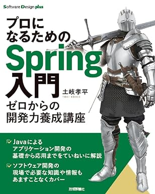
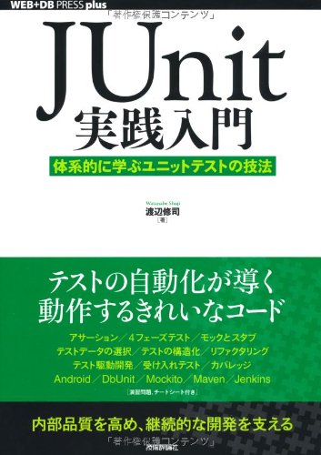
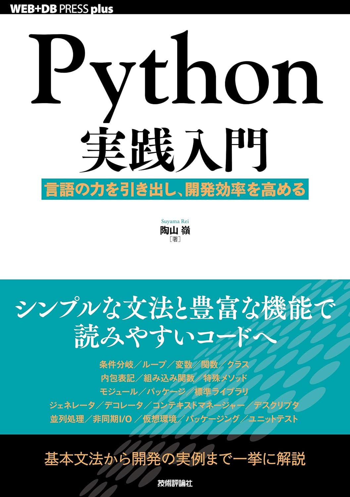
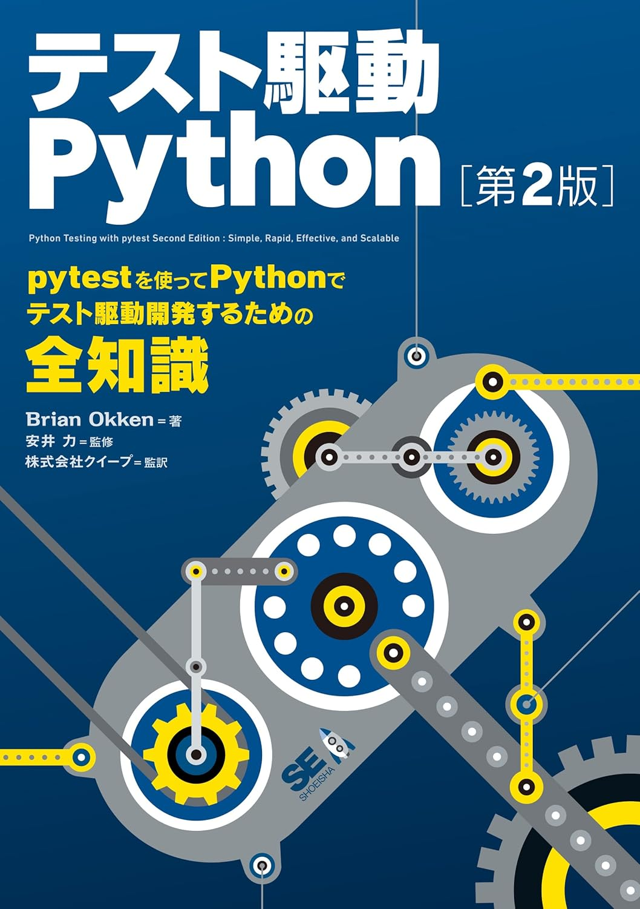
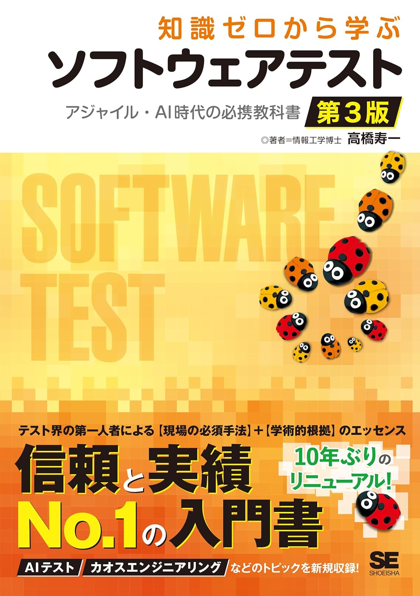
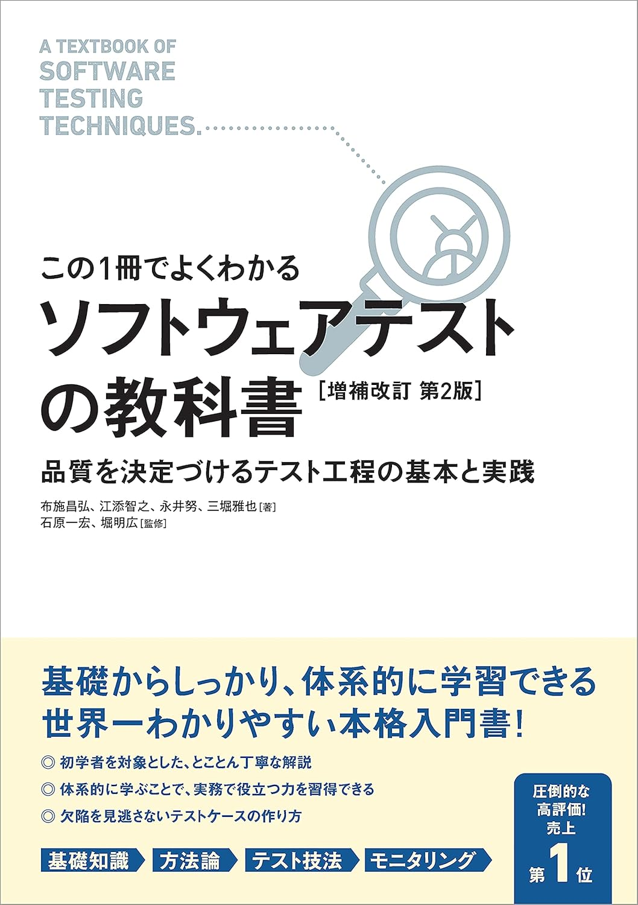
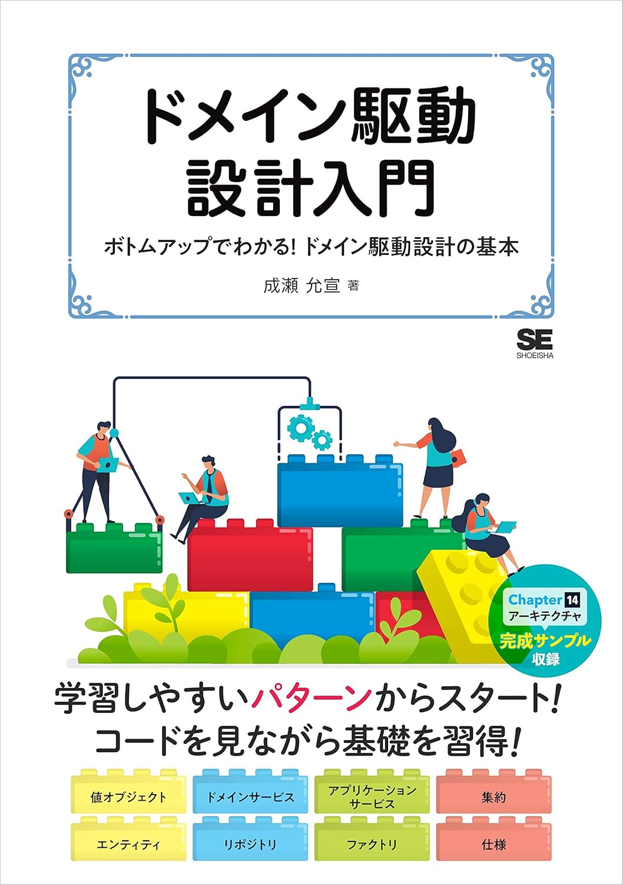
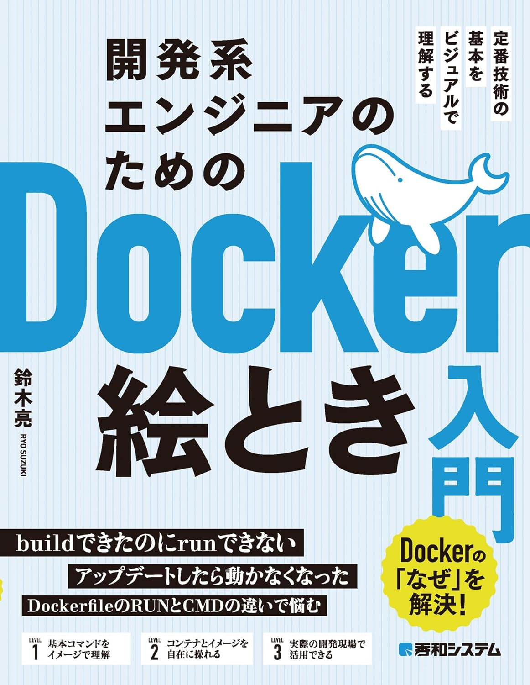

# 書籍一覧

## 目次
1. [Springフレームワーク](#Springフレームワーク)
2. [Java](#Java)
3. [GO](#GO)
4. [JavaScript](#JavaScript)
5. [Python](#Python)
6. [テスト関連](#テスト関連)

## Springフレームワーク

### [■プロになるためのSpring入門ーーゼロからの開発力養成講座](https://www.amazon.co.jp/dp/4297136139)
レベル：初心者向け  
初学者では内容が難しいところもあるが現場ではすべて必須レベルの知識のため是非学習してほしい

### [■Spring徹底入門 第2版 Spring FrameworkによるJavaアプリケーション](https://www.amazon.co.jp/dp/479818134X)
レベル：中級者向け  
Springの内容をマスターしたい人向け

## Java

### [■Effective Java 第3版 ](https://www.amazon.co.jp/dp/4621303252)
レベル：中級者向け  
Javaプログラミングに関するステップレベルでの実装パターン、ベストプラクティス、ガイドラインで一段階上に行く開発者に必読の本  

### [■Java言語で学ぶデザインパターン入門第3版 ](https://www.amazon.co.jp/dp/4815609802)
レベル：中級者向け  
オブジェクト指向プログラミングにおいて古典的な23個のデザインパターン記載した本
以下の基本的なパターンは押さえておきたい  
Singleton、Factory Method、Observer、Strategy、Adapter、Decorator、Command

### [■JUnit実践入門 ](https://www.amazon.co.jp/dp/477415377X)
レベル：初心者向け  
Javaでユニットテストの実施方法が記載されている。
内容が少し古く、バージョンがJunit4のものとなる。

### [■Javaエンジニアのための ソフトウェアテスト実践入門　～自動化と生成AIによるモダンなテスト技法 ](https://www.amazon.co.jp/dp/4297144352)
レベル：初心者向け  
こちらはJUnit 5ベースで記述されている。

## GO

### [■初めてのGo言語 ―他言語プログラマーのためのイディオマティックGo実践ガイド ](https://www.amazon.co.jp/dp/4814400047)
レベル：初心者向け  
初めてGoを触る人向けで基本的な文法を学べる

### [■改訂2版 基礎からわかる Go言語 ](https://www.amazon.co.jp/dp/B06WP6S2QT)
レベル：初心者向け  
こちらも初めてGoを触る人向けで基本的な文法を学べる。電子書籍しかなかった気がする。

## JavaScript

## Python

### [■Python実践入門 ](https://www.amazon.co.jp/dp/429711111X)
レベル：初心者向け  
初めてPythonを触る人向け

### [■テスト駆動Python 第2版  ](https://www.amazon.co.jp/dp/4798177458)
レベル：中級者向け  
Pythonのユニットテストについて記載されている。

## テスト関連

### [■知識ゼロから学ぶソフトウェアテスト 第3版 アジャイル・AI時代の必携教科書](https://www.amazon.co.jp/dp/4798182435)
レベル：初心者向け  
ソフトウェアテストについて初めて対応する人向けの本。

### [■【この1冊でよくわかる】ソフトウェアテストの教科書　［増補改訂 第２版］ ](https://www.amazon.co.jp/dp/B093Q13V96)
レベル：初心者向け  
ソフトウェアテストの技法として同値分割テスト・境界値テスト、ディシジョンテーブルの書き方などテストに関して基礎的なことが書いている。

### [■土台からしっかり学ぶーーソフトウェアテストのセオリー](https://www.amazon.co.jp/dp/4865943625)
レベル：初心者向け  
こちらも同様にソフトウェアテストについて記載されている。

## アーキテクチャ

### [■ドメイン駆動設計入門 ](https://www.amazon.co.jp/dp/B082WXZVPC)
レベル：初心者向け  
初めてDDD触る人向け。初心者にもわかりやすく書いてある。

### [■手を動かしてわかるクリーンアーキテクチャ ](https://www.amazon.co.jp/dp/429501978X)

## 開発関連

### [■リーダブルコード ―より良いコードを書くためのシンプルで実践的なテクニック (Theory in practice)  ](https://www.amazon.co.jp/dp/4873115655)
レベル：初心者向け  
可読性の良いコードを記載するための書籍。初めて実装する人は読んでおきたい。

### [■Good Code, Bad Code ～持続可能な開発のためのソフトウェアエンジニア的思考 ](https://www.amazon.co.jp/dp/B0BSW72QKZ)
レベル：中級者向け  
きれいなコードが書きたい人に。リーダブルコードより実践的に記載されている。

### [■なぜ依存を注入するのか　DIの原理・原則とパターン ](https://www.amazon.co.jp/dp/4839983062)
レベル：上級者向け  
依存と注入について細かく書かれている。

## アジャイル

### [■SCRUM BOOT CAMP THE BOOK【増補改訂版】 スクラムチームではじめるアジャイル開発 ](https://www.amazon.co.jp/dp/4798163686)
レベル：初心者向け  
アジャイルにて初めてスクラム開発をする人にお勧め

### [■SCRUMMASTER THE BOOK 優れたスクラムマスターになるための極意――メタスキル、学習、心理、リーダーシップ ](https://www.amazon.co.jp/dp/4798166855)
レベル：初心者向け  
スクラムマスターに関する書籍

## GIT

### [■GitHub CI/CD実践ガイド――持続可能なソフトウェア開発を支えるGitHub Actionsの設計と運用 ](https://www.amazon.co.jp/dp/4297141736)

## Docker

### [■開発系エンジニアのためのDocker絵とき入門 ](https://www.amazon.co.jp/dp/B0CSFF6QYD)
レベル：初心者向け  
分かりやすく初心者にお勧めらしい。

### [■仕組みと使い方がわかる Docker&Kubernetesのきほんのきほん ](https://www.amazon.co.jp/dp/4839972745)
レベル：初心者向け  
初めて触る人にいいかも。かなり丁寧に書いてある。

## AWS

## web系

### [■［改訂新版］プロになるためのWeb技術入門 ](https://www.amazon.co.jp/dp/4297145715)

### その他

### [■エンジニアが一生困らない ドキュメント作成の基本](https://www.amazon.co.jp/dp/4802614845)

